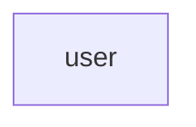

# トランザクションスクリプトアプリケーションをサクっと書くためのテンプレートの検討

## 主題

CRUD機能あるいはETL機能を白紙からサクっと書く場合、どんなアーキテクチャにするのがよいか（アイデアだし）

### 当面の目標

Java/Spring Bootプロジェクトの参照コード（案）

- ビルドスクリプト（依存ライブラリ）
- トップレベルのパッケージ構造
- 各パッケージに最低一つのクラス実装例

留意事項

- 枯れた技術を組み合わせる（信頼できるサンプルや参考情報が手に入りやすいこと、現在および将来）
- 自動テストは任意。書くとしたら、アプリケーションサービスの動作確認（データベースアクセスまで結合、画面の自動テストなし）

### 背景

"Learning Domain-Driven Design"で、業務ロジックが**単純**な場合、トランザクションスクリプトやアクティブレコードでサクっと作るべき、という記述があった。

業務ロジックが単純な場合、Java/Spring Bootで、CRUDアプリケーション、ETLアプリケーションを作る場合、どんなアーキテクチャが推奨されるか？

初心者向けのサンプルではなく、ある程度経験のあるJava開発者が選択するとしたら、どんな感じになるだろうか？

### 想定

- 業務ロジックは複雑にならない（バリデーションとデータ形式変換が必要十分なロジック）
- データ構造はフラット（項目が増えることはある）、階層構造にはならない

## お題

### CURD アプリケーション

利用者の基本情報の登録と管理（利用者本人および管理者）

### ETL アプリケーション

郵便番号データを公開されているデータファイルからローカルのデータベースに取り込む

### 実装レベル

- レベル０：動かない　ビルドスクリプトとサンプルコードのみ
- レベル１：いちおう動く
- レベル２：バリデーション、データベース制約、エラー情報の表示を実装済
- レベル３：最小限のユーザー認証
- レベル４：最小限の運用機能（ロギング、死活監視）

## CRUDアプリケーションの概要

### アクター
- 利用者（セルフサービス）
- 管理者

### データ項目

- 氏名
- 連絡先(電子メール、電話番号)
-  
### 機能

#### 第一形態

最少機能

####
