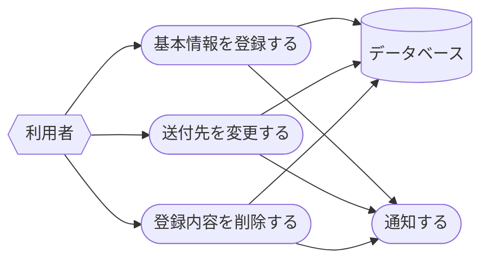
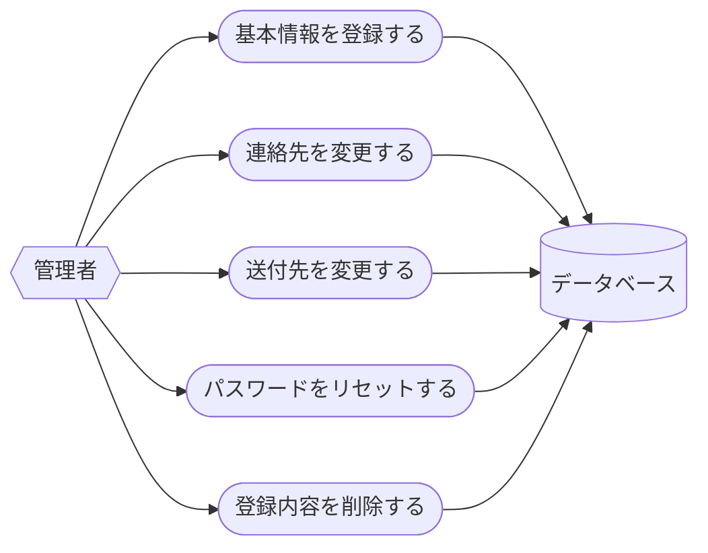

# トランザクションスクリプトアプリケーションをサクっと書くためのJava/Spring Bootテンプレートの検討

## 主題

CRUD機能あるいはETL機能を白紙からサクっと書く場合、どんなアーキテクチャにするのがよいか（アイデアだし）

### 当面の目標

Java/Spring Bootプロジェクトの参照コード（＝アーキテクチャのアイデア）

- ビルドスクリプト（依存ライブラリ）
- トップレベルのパッケージ構造
- 各パッケージに最低一つのクラス実装例

留意事項

- 枯れた技術を組み合わせる（信頼できるサンプルや参考情報が手に入りやすいこと、現在および将来）
- 自動テストは任意。書くとしたら、アプリケーションサービスの動作確認（データベースアクセスまで結合、画面の自動テストなし）

### 背景

"Learning Domain-Driven Design"で、業務ロジックが**単純**な場合、トランザクションスクリプトやアクティブレコードでサクっと作るべき、という記述があった。業務ロジックが単純な場合、複雑な業務ロジックを独立させたドメインモデル層は、アプリケーションアーキテクチャとして不必要な複雑さを持ち込む、という捉え方。

業務ロジックが単純な場合、Java/Spring Bootで、CRUDアプリケーション、ETLアプリケーションを作る場合、どんなアーキテクチャが推奨されるか？

初心者向けのサンプルではなく、ある程度経験のあるJava開発者が選択するとしたら、どんな感じになるだろうか？

### 想定

- 業務ロジックは複雑にならない（バリデーションとデータ形式変換が必要十分なロジック）
- データ構造はフラット（項目が増えることはある）、階層構造にはならない
- もし要求が複雑になった場合は、拡張するのではなく、データベース設計も含めて、別のアーキテクチャで作り直す

## お題

### CURD アプリケーション

利用者の基本情報の登録と管理（利用者本人および管理者）

### ETL アプリケーション

郵便番号データを公開されているデータファイルからローカルのデータベースに取り込む

### 実装レベル

- レベル０：動かない　ビルドスクリプトとサンプルコードのみ
- レベル１：いちおう動く
- レベル２：バリデーション、データベース制約、エラー情報の表示を実装済
- レベル３：最小限のユーザー認証
- レベル４：最小限の運用機能（ロギング、死活監視）

## CRUDアプリケーションの概要

### アクター
- 利用者（セルフサービス）
- 管理者

### データ項目

- 氏名
- 連絡先(電子メール、電話番号)
- 送付先(郵便番号、住所）
- 生年月日

サンプルデータ（テストデータ）は、テストデータ生成サービスなどを使って現実的なデータにすること

### 機能

#### 第一形態

- 最少機能

#### 第二形態

- 利用者のセルフサービス全機能（登録、送付先の変更、削除）
- ユーザー認証（ID=メールアドレス、パスワード=固定、ハッシュ化）
- メールでイベント発生を通知（固定文面、疑似）

#### 第三形態

- 管理者機能を追加する

## ETLアプリケーションの概要

- 郵便番号データを取得して、ローカルなデータベースに取り込む
  - 全件投入(任意の時点）
  - 差分更新(月一回定期）
- ソースデータ
  - 日本郵便のダウンロードページから取得
- ターゲット
  - データベース
  - データ項目は、CRUDアプリケーションの送付先の入力支援/入力検証に必要な内容

### 実装

#### 第一形態

手動でダウンロードした全件ファイルを対象に実行可能

#### 第二形態

手動でダウンロードした差分ファイルを対象に実行可能

#### 第三形態

ダウンロードを実行（コマンドラインから手動で起動）

#### 第四形態

スケジューラで、差分取り込みを定期実行

